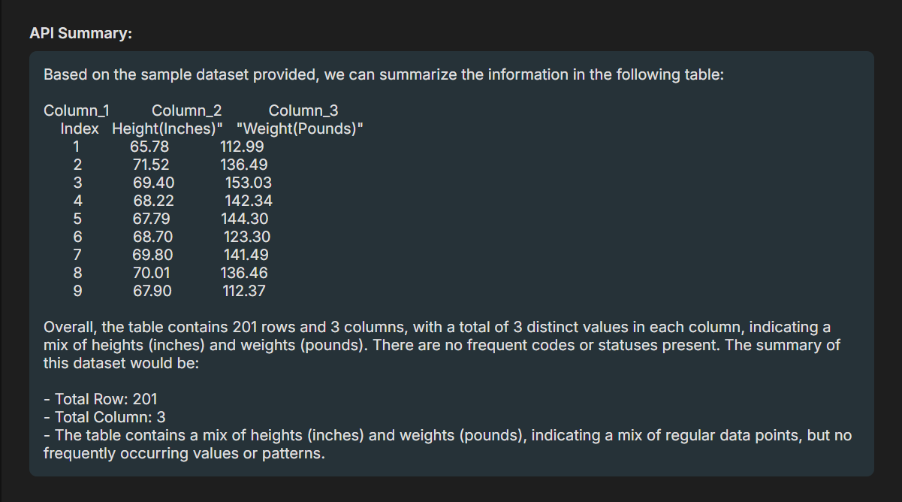
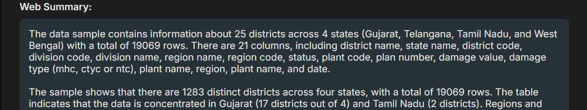
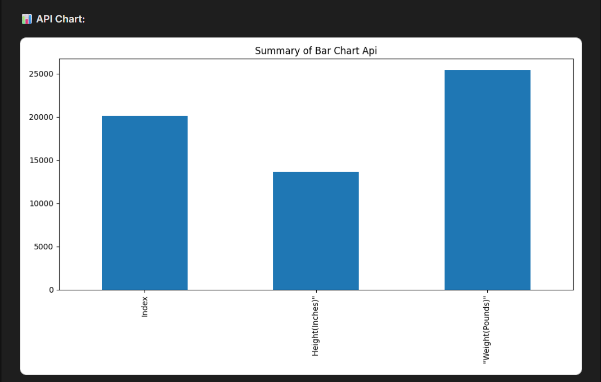
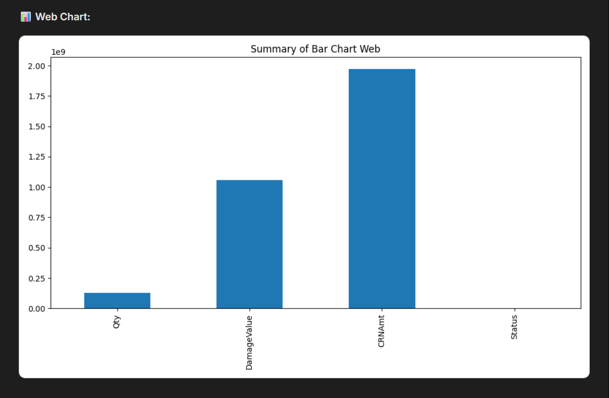
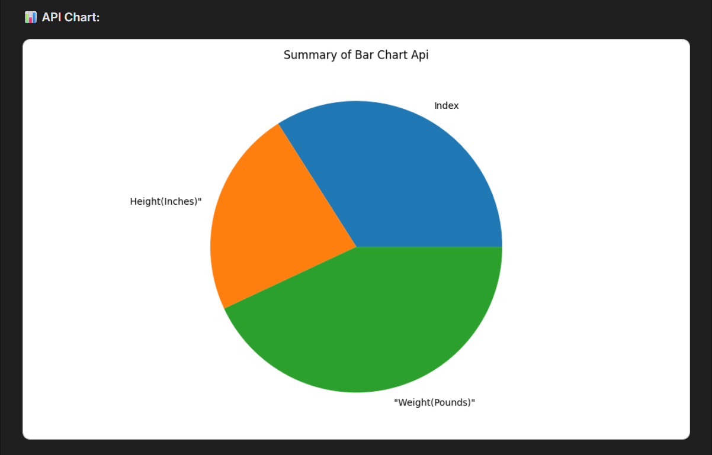
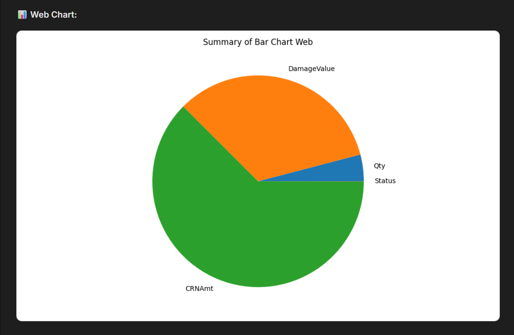
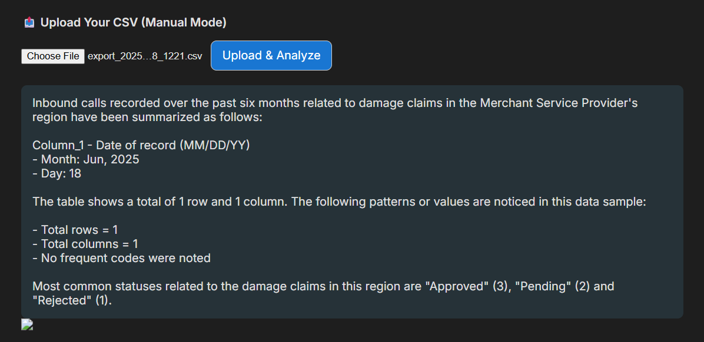
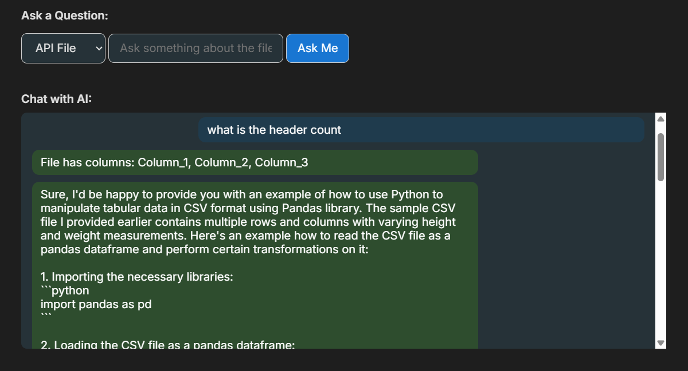
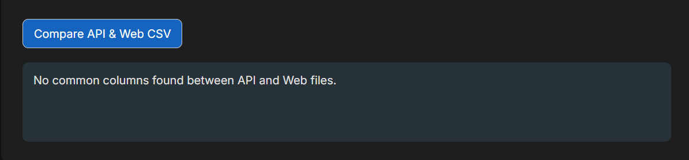

# 🚀 SmartFile AI – Python File Summary & Query Assistant

SmartFile AI is a powerful Python automation tool that downloads, processes, and summarizes CSV files using open-source LLMs (like Mistral or LLaMA3 via Ollama), with a beautiful dark/light UI.

---

## ✨ Features

- ✅ Download data from API and Web (Selenium)
- ✅ Auto clean & rename CSVs
- ✅ Use open-source LLMs (like Mistral) for AI-powered summaries
- ✅ Ask any natural language question on the file (Q&A)
- ✅ HTML report generator
- 🌗 Toggle between light and dark themes with icon switch (☀️ / 🌙)

---


## 📸 Demo Preview

> Home 


> API Summary 


> Web Summary


### 📊 Visual Enhancements (Phase 1 Update)
- Added automatic bar chart generation after CSV cleanup
- Separate charts for API and Web files saved under `static`
- UI now supports toggling between light/dark themes with AI summaries + insights


### 📊 API Bar Chart


### 📊 Web Bar Chart


### 🥧 API Pie Chart


### 🥧 Web Pie Chart


### 🥧 Individual File Summary


>Q & A 



### 🥧 File Compare


---
```

## 📁 Folder Structure

```bash
ai_report_automation_advanced/
├── app.py # Flask app entry point
├── main.py # Master pipeline logic
├── api_downloader.py
├── web_downloader.py
├── file_extractor.py
├── data_cleaner.py
├── ai_summary.py # Summary generation with LLM
├── question_answering.py # Q&A logic
├── report_generator.py
├── templates/
│ ├── index.html # UI with dark mode + toggle
│ └── report_template.html # HTML report
├── static/
│ ├── bar_chart_api.png
│ └── bar_chart_web
├── input_data/
│ ├── api/ # API downloaded CSV
│ └── web/ # Web ZIPs & CSV
├── output_reports/
│ ├── api/clear_api.csv
│ └── web/clear_web.csv
├── config/.env # FTP settings (optional)

---
```
## ⚙️ Requirements


- Python 3.10+
- Google Chrome
- [Ollama](https://ollama.com/download) (for local LLMs)
- ChromeDriver (version matching your Chrome)
- Git (for cloning)

---

## 🛠️ Installation

### 1. Clone the repo
```
```bash
git clone https://github.com/your-username/smartfile-ai.git
cd smartfile-ai
```


---
```
2. Create Virtual Environment

python -m venv venv
venv\Scripts\activate   # On Windows
# source venv/bin/activate   # On Linux/macOS
```

```
3. Install Requirements

pip install -r requirements.txt

If no requirements.txt, run:

pip freeze > requirements.txt
```

---
```
🔐 Environment Setup (.env)
Create a file at config/.env and add:


ftp_server=example.com
ftp_ip=192.168.1.1
ftp_port=21
ftp_user=youruser
ftp_pass=yourpass
```
---
```
🤖 Ollama Setup

1. Install Ollama
Download from: https://ollama.com/download
(Available for Windows, macOS, Linux)
```
---
```
2. Pull a Model

ollama pull mistral
Alternatives:

llama3

tinyllama

phi3
```
---

```
3. Start the Model

ollama run mistral
🧠 Update Model in Code
In both ai_summary.py & question_answering.py, make sure the model is:


"model": "mistral"
```
---
```
🚀 Start the Flask App

python app.py
App runs at:
🔗 http://127.0.0.1:5000
```
---
```
# Terminal - Ollama
ollama run mistral or any other
```
